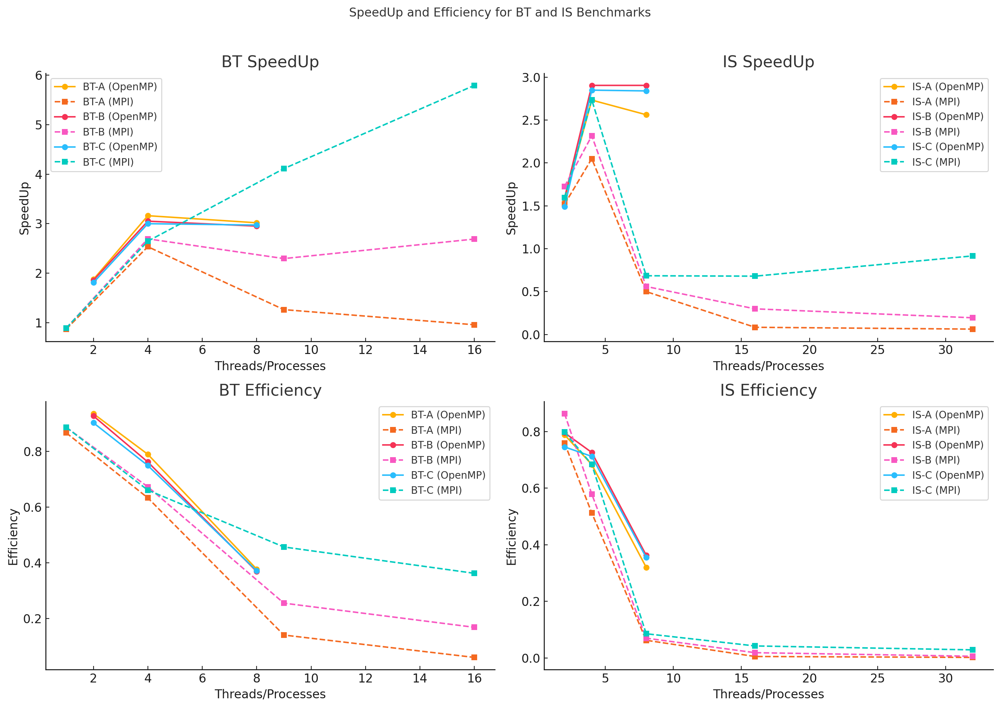

# EXERCICI_1
**Authors:** Marc Gaspà & Raul Hidalgo

## Analysis of the chosen benchmark

### BT
BT is a structured grid benchmark that solves a synthetic system of nonlinear partial differential equations.
It represents implicit finite-difference applications, commonly found in computational fluid dynamics (CFD).
The computation involves solving block tridiagonal systems at each grid level.
The computation is dominated by communication between neighboring processes, leading to a high communication overhead.
It uses coarse-grain parallelism, where large blocks of data are assigned to different processors.
The main challenge is synchronization, as processes need to communicate frequently to exchange boundary data.
The memory access pattern is regular, with structured accesses to large matrices.

### IS
IS is based on the bucket sort algorithm, which is used to sort a list of randomly generated integers.
It measures the performance of integer sorting, which is crucial for applications like databases, cryptography, and data analytics.
The benchmark is memory-access intensive rather than compute-intensive.

## Description of the machine to compare
Moore is an homogeneous Cluster with a total of 32 processing units and 32GB of main memory, distributed over 8 nodes with an Intel Core i5 processor with 4 cores at 3.1 GHz and 4GB of main memory.

The Moore cluster is best classified as a Distributed Memory Architecture rather than a Shared Memory or Hybrid system.
In a distributed memory system, each processor or node has its own local memory, and processors must communicate using message passing (e.g., MPI - Message Passing Interface).
Moore’s 8 nodes each have separate memory pools, meaning they must use network-based communication to share data.
This aligns with the Distributed Memory Architecture model.

## Serial, OpenMP and MPI Results

### BT
| Class | SERIAL | OPENMP 2 | OPENMP 4 | OPENMP 8 | MPI 1  | MPI 4  | MPI 9  | MPI 16 |
|-------|--------|----------|----------|----------|--------|--------|--------|--------|
| A     | 48.01  | 25.64    | 15.19    | 15.91    | 55.34  | 18.95  | 38.06  | 50.24  |
| B     | 204.14 | 109.97   | 66.93    | 69.20    | 230.09 | 75.80  | 89.00  | 75.93  |
| C     | 847.66 | 469.10   | 282.62   | 285.26   | 955.23 | 320.41 | 206.12 | 146.26 |

### IS
| Class | SERIAL        | OPENMP 2 | OPENMP 4 | OPENMP 8 | MPI 2  | MPI 4  | MPI 8 | MPI 16 | MPI 32 |
|-------|---------------|----------|----------|----------|--------|--------|-------|--------|--------|
| A     | 0.41          | 0.26     | 0.15     | 0.16     | 0.27   | 0.20   | 0.82  | 4.88   | 6.54   |
| B     | 1.83          | 1.15     | 0.63     | 0.63     | 1.06   | 0.79   | 3.27  | 6.12   | 9.39   |
| C     | 8.89 (aprox)  | 5.96     | 3.12     | 3.13     | 5.57   | 3.25   | 12.98 | 13.07  | 9.70   |

### Plot

## Analysis of benchmarking results in relation to main characteristics of the benchmarks

### Why is the SpeedUp different for different benchmarks?

#### Computation vs. Communication Overhead:
BT (Block Tridiagonal Solver) is a more compute-intensive benchmark with complex dependencies, meaning parallelization benefits depend on how efficiently tasks are distributed. The overhead of synchronizing computations can limit SpeedUp.
IS (Integer Sorting) is a memory- and communication-heavy benchmark. Sorting requires frequent data exchanges, which limits performance gains when using more processes.

#### Workload Characteristics:
BT has structured computation, making it easier to optimize with OpenMP (shared memory) or MPI (distributed memory).
IS relies on data exchanges, making it more sensitive to communication overhead.

#### Parallelization Efficiency:
In BT, SpeedUp is relatively higher, especially for OpenMP, because computations are more localized.
In IS, MPI-based implementations do not scale well, especially with a high number of processes, due to increasing communication costs.

### Is Efficiency equal for any benchmark?
No, efficiency is not equal across benchmarks due to varying computation-to-communication ratios.

BT maintains better efficiency in OpenMP cases, as it benefits from shared memory and minimal communication overhead.
IS exhibits lower efficiency in MPI cases, especially with many processes, because communication and memory access bottlenecks increase.

So, efficiency varies significantly across benchmarks and programming models.

### How is the benchmark’s scalability?
Scalability refers to how well a program maintains performance gains as more threads or processes are added.
* BT shows better strong scalability in OpenMP, meaning that increasing threads improves performance significantly, but there are diminishing returns.
* IS scales poorly in MPI, especially beyond MPI 8, due to increasing communication overhead.

### Why is scalability so different for OpenMP and MPI?
OpenMP (shared memory) performs better for BT because:
* No need to transfer data between nodes.
* Lower communication overhead.
* Works best on a single machine with many cores.
MPI (distributed memory) struggles for IS because:
* Sorting requires frequent data movement between nodes.
* High communication cost reduces scalability.
* MPI works better for embarrassingly parallel problems, which IS is not.
Thus, OpenMP generally scales better within a single machine, while MPI struggles with communication-heavy workloads.
